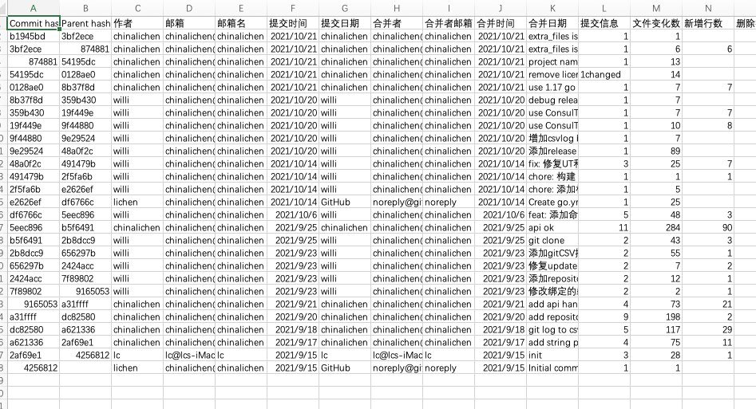

# gitlog

生成 git 仓库的 commit 日志。本仓库的 [gitlog.csv](./docs/gitlog.csv)。

## 用法
1. 获取 gitlog 可执行文件，有以下两种方式；
   1. 下载官方发布的 [gitlog 可执行文件](https://github.com/chinalichen/gitlog/releases) ；
   2. 或者下载[代码](https://github.com/chinalichen/gitlog#:~:text=with%20GitHub%20Desktop-,Download%20ZIP,-Latest%20commit)自行编译。
2. 将 gitlog 可执行文件复制到某个 git 仓库根目录下；
3. 执行 `chmod +x gitlog` 增加执行权限；
4. 执行 ./gitlog，得到 gitlog.csv。可以使用 Excel 打开该 csv 文件分析 commit 日志了。

